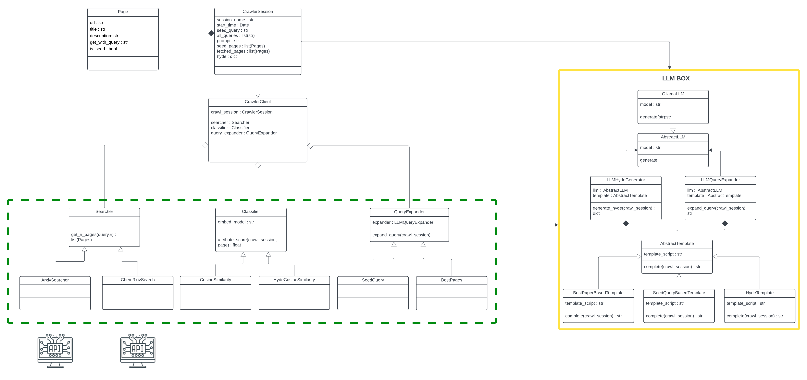

# How to use Generative Models to Improve Focused Crawling?

**Abstract**  


## Code Architecture


## How to Use the Code
Before running the code, make sure to choose the correct saving directory, use case, and searcher.

### Step-by-Step Instructions:

#### 1. Install Ollama
Open the first terminal and run the following commands to install and start Ollama:
```bash
curl https://ollama.ai/install.sh | sh
ollama serve
```
#### 2. Set Up the Python Environment
In a second terminal, navigate to the project directory and create a virtual environment:
```bash
cd demokritos_internship/
python -m venv venv
source venv/bin/activate
pip install -r requirements.txt
ollama pull llama3.2
```
#### 3. Run Focused Crawlers
```bash
run_crawler.py
```